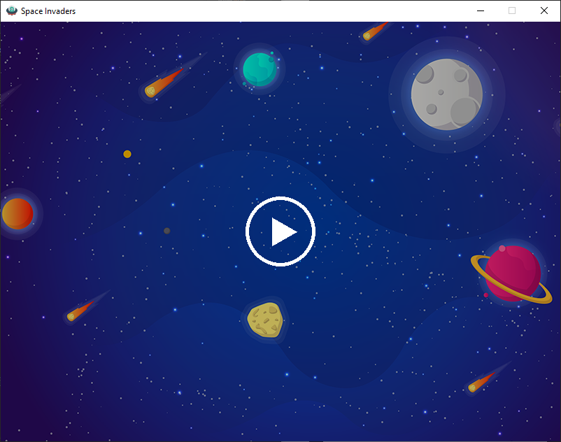

# Space Invader 2.0.0
A space invader game with self-added features, written in Python using the Pygame library.
## Install Pygame
Make sure Python 3 is installed on your computer. If not, download Python 3 from the official website [Python](http://www.https://www.python.org/ "Python"). 

Run the following command in the terminal to install the Pygame library.
```bash
$ pip3 install pygame
```

## Run Application
Download the source code from the respository and run the file with the command.
```bash
$ python3 Space-Invader-Pygame/src/main.py
```
## Screenshots
### Start Menu

### Game View

### Level Up

### Game Over

## Prerequisites
* [Python](https://www.python.org/ "Python")
* [Pygame](https://www.pygame.org/ "Pygame")


## Future Updates
1. Add more enemies 

2. Add enemy spaceships who can shoot lasers

3. Add barriers 

4. Use Rect objects to improve collision precision

5. Improve runtime 

## Contributors
* Wei Lin Chen 

## Acknowledgements
This project is based on the works of Pygame Tutorial for Beginners on [freeCodeCamp](http://www.freecodecamp.org/ "freeCodeCamp"). The image and sound files were obtained from the original repository. Any additional knowledge were obtained from the offical Pygame documentations.

* [Pygame Tutorial Video](https://www.youtube.com/watch?v=FfWpgLFMI7w)
* [Original Github Repository](https://github.com/attreyabhatt/Space-Invaders-Pygame)
* [Pygame Documentations](https://www.pygame.org/docs/)
